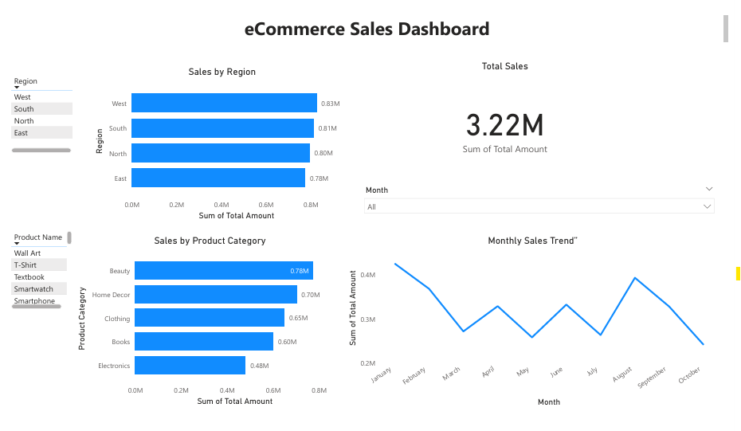

# 📊 E-Commerce Sales Analysis Dashboard

This project analyzes e-commerce sales performance to uncover insights about **profit trends, sales by region, customer segments, product categories, and shipping efficiency**.  
The analysis was done using **Python** for data cleaning and **Power BI** for data visualization.

---

## 🖼 Dashboard Preview

---

## 🎯 Project Objectives
- Identify **top performing** product categories and sub-categories.
- Analyze **regional** and **state-wise** sales distribution.
- Understand **customer segment** demand and profitability.
- Compare **delivery times** and examine shipping impact on sales.
- Provide actionable insights for **business decision making**.

---

## 🧰 Tools & Technologies Used
| Tool / Library | Purpose |
|---|---|
| **Python (Pandas, NumPy)** | Data cleaning & preprocessing |
| **Matplotlib** | Data exploration plots |
| **Power BI** | Interactive dashboard creation |
| **GitHub** | Project hosting & version control |

---

## 🗂 Project Structure
Ecommerce-Sales-Analysis
│
├── data/
│ └── ecommerce_sales.csv
│
├── analysis/
│ └── Ecommerce_Sales_Analysis.ipynb
│
├── dashboard/
│ └── Ecommerce_Sales_Dashboard.pbix
│
├── reports/
│ └── Dashboard_Summary.pdf
│
└── README.md

---

## 🔍 Key Insights
- **Office Supplies** and **Technology** categories generated the highest sales.
- Certain regions performed significantly better, indicating focused market opportunity.
- **Standard class** shipping was most used, but **first class** showed better profit margins.
- Customer segment **‘Consumer’** contributed the highest revenue volume.

---

## 💼 Business Impact
This analysis helps stakeholders:
- Optimize **inventory planning** based on demand pattern.
- Focus **marketing efforts** in high-profit regions.
- Improve **delivery strategies** by comparing shipping effectiveness.
- Identify **high-value customer segments** for retention and targeted offers.

---

## 🚀 How to Use
1. Open `.ipynb` file to view Python cleaning workflow.
2. Open `.pbix` file in Power BI Desktop to interact with the dashboard.
3. Refer to PDF report for summarized insights.

---

## 👤 Author
**Chandini Chandran**  
🔗 LinkedIn: https://www.linkedin.com/in/chandini-chandran  

---

## ⭐ If you found this helpful
Don’t forget to **star** this repository 😊
